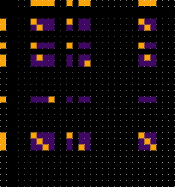

# common-x: Example 1
> *common-x {x: substrings}*

> note: github latex rendering seems broken on mobile/ ios?

## background

Most problems can be formulated in terms of an abstract *"problem-space"*, within which the problem's respective solution might/must be found [^lso].

> we'll sometimes refer to these as *(set-theoretic) "subset problems"*, in that the solution is a subset of a problem set

The solution to some *"problem-space problems"* are formuable in terms of the *(set-theoretic)* intersection $\cap$ , between two or more abstract reference-frames.

> we'll sometimes refer to these as *(set-theoretic) "intersection problems"*, in that the solution subset corresponds with the intersect between two problem sets

In plain terms: the intersection between two reference-frames contains whatever is common between them, so in this way, *"intersection problems"* are *"common-x problems"*

The interesting thing about *"intersection/ common-x problems"*, is that, where the solution for a *"subset problem"* must be defined *(explicitly or implicitly)* in advance or externally, for *"intersection/ common-x problems"*, the solution is undefined until found.

Often the discussion of the evolution of cogntion is waylaid by a dependency on pre-determined solutions, which cognition must then solve -- but a far simpler, far more humble origin to our own cognitive circumstances, is that attention *(to the defintion and subsequent exploration of solutions)* must result naturally in some way, which, *(i think uncontrovertially and inescapably)*, aligns with the structural and operational mechanics of *"intersection/ common-x problems"* to be described in a series of related repositories

> *(but also the echoes and mechanics of which persist, as the same analogical basis for cognition as described by Douglas Hofstadter in "Surfaces and Essences")*

This repository will contain the details of one example -- *(example 1)* -- of *"intersection/ common-x problems"*; and will be referenced by other more detailed analyticcal and synthetic project repositories.

---

## common-x: substring source

Consider two *"input strings"* $A$, and $B$:-

> ### $A$:
> *[data](/data/a.txt) | [meta](/data/a-meta.txt)*
> 
> In computer science, a longest common substring of two or more strings is a longest string that is a substring of all of them. There may be more than one longest common substring. Applications include data deduplication and plagiarism detection.
> 
> — [wikipedia: longest common substring](https://en.wikipedia.org/wiki/Longest_common_substring)

> ### $B$:
> *[data](/data/b.txt) | [meta](/data/b-meta.txt)*
> 
> A longest common subsequence (LCS) is the longest subsequence common to all sequences in a set of sequences (often just two sequences). It differs from the longest common substring: unlike substrings, subsequences are not required to occupy consecutive positions within the original sequences.
> 
> — [wikipedia: longest common subsequence](https://en.wikipedia.org/wiki/Longest_common_subsequence)

---

## preparation: stopwords

Before processing, our input-strings $A$ and $B$ must be *"cleaned"* — in the sense of a "*qualitative filter*" on constituent words — to remove problematic analytical noise, known as "*stopwords*".

> "Stop words are the words in a stop list (or stoplist or negative dictionary) which are filtered out ("stopped") before or after processing of natural language data (i.e. text) because they are deemed to have little semantic value or are otherwise insignificant for the task at hand"
> 
> — [wikipedia: stopwords](https://en.wikipedia.org/wiki/Stop_word)

We'll define a list of *stopwords* $Sl$, to be excluded from input-strings $A$ and $B$:-

$$Sl = \lbrace a, in, is, of, or, the, to, that \rbrace$$

Such that:-

$$A \to A2 = A\setminus{sl}$$

...and...

$$B \to B2 = B\setminus{sl}$$

Accordingly:-

> ### $A2$
> 
> computer science longest common substring two more strings longest string substring all them there may be more than one longest common substring applications include data deduplication plagiarism detection
> 
> — *[A2 (clean)](/data/a-clean.txt) | [A (original)](/data/a.txt)*

> ### $B2$
> 
> longest common subsequence lcs longest subsequence common all sequences set sequences often just two sequences it differs from longest common substring unlike substrings subsequences are not required occupy consecutive positions within original sequences
> 
> — *[B2 (clean)](/data/b-clean.txt) | [B (original)](/data/B.txt)*

---
---

## problem-space overview
> *on complexity*

Both *"subset problems"* and *"intersection problems"* reduce to *"finding things in spaces"*; and, simplifying -- the larger the space, the more complex/ difficult the challenge *(of finding what is sought)*

The complexity of a common-substring problem is typically framed in terms of Big-O notation, which captures the relatioship between the size of inputs, and the corresponding product-space, which for common-x problems generally, is $O(n^{2})$

Specifically, given:-

$$n = |A2| = 28$$

...and...

$$m = |B2| = 33$$

Subsequently, the area of the *"problem-space"* of *"example 1"* — *(within-which all common words and substrings thereof, might/must be found)* — is...

$$n \times m = |A2| * |B2| =  28 \times 33 = 924$$

---

## solution overview
> *the solution in words*

Before next steps, we ought to detail the solution -- the *"common words and substrings" themselves*.

Let $cws$ be the set of common-words-&-substrings for $A2$ and $B2$

$$cws = \lbrace "longest{ }common{ }substring", "longest{ }common", "longest", "common", "substring", "two", "all" \rbrace$$

> the longest common substring then — *(of length 3)* — is no less than the string of words *"longest common substring"*

---
---

## visualisations
> *seeing things, in spaces*

---

### visualising input-strings

#### $A2$
> *[A2 (clean)](/data/a-clean.txt) | [A (original)](/data/a.txt)*

> Fig x: represents the input string $A2$ of length $28$

#### $B2$
> *[B2 (clean)](/data/b-clean.txt) | [B (original)](/data/B.txt)*

> Fig x: represents the input string $B2$ of length $33$

---

### visualising problem-space

For two input-strings $a,b$ of lengths $n,m$, set to axes $x,y$, *respectively*; the area of the corresponding two-dimensional problem-space is equal to $n \times m$

> or $O(n \times m)$

> Fig x: depicts a $28 * 33$ grid, which represents the higher-dimensional projection of $A2 \times B2$ , or problem-space, within which the solution is to be found

> $$n \times m = |A2| * |B2| =  28 \times 33 = 924$$

---

### visualising the solution within problem-space

> Fig x: depicts the solution to the common-substring problem for input-strings $A2$ and $B2$ within a $28 * 33$ grid; with common-words marked by orange dots/squares; and common-substrings *(of words)* represented by diagonal-lines

Earlier, we noted that the longest common-substring is 3 words long.

Now as we visualise the solution within problem-space, note that the longest common-substring appears twice in $A2$, yet only once in $B2$.

> *(so therefore twice along the $x$ axis, but only once on the $y$ axis — represented by the fact that the two respective diagonal-lines of length 3, occupy the same vertical space)*

---

### visualising problem-space *"polarity"*: positive-space, and negative-space

The *(above and)* below image depicts the distribution of solution-space within problem-space.

We will sometimes refer to the solution within *"problem-space"* in the absolute term: *"solution-space"*.

Other times, it will be useful to refer to both *"solution-space"*, and *"problem-space which is not solution-space"*

For convenience, we'll refer to:-

- the former as *"positive-space" (or, solution-positive space)*, and;

- the latter as *"negative-space" (or solution-negative space)*

> Fig x: depicts the positive-space by orange dots/squares; with negative-space uncolored

This distinction between positive and negative space will form the basis of several generalised methods for *"finding things, in spaces"*.

---

### visualising the relationship between lower-dimensional input-strings, and higher-dimensional problem-space

All common-form must exist in both lower-dimensional spaces

Now that we can visualise *"positive-space"* within the two-dimensions of *"problem-space"*, let's also take a look at inter-dimensional correspondence/ alignment, between higher andd lower dimensional space

> Fig x : depicts the correspondence between lower and higher dimensional representations of positive-space; where input-strings are lower-dimensions, and problem-space as the higher-dimensional product; with A2 on top; and B2 down the left

#### $A2$ (top)

> Fig x : depicts the elements of input-string $A2$ which correspond with positive-space by orange dots/squares, (with negative-space uncolored)

#### $B2$ (left)

> Fig x : depicts the elements of input-string $B2$ which correspond with positive-space by orange dots/squares, (with negative-space uncolored)

Higher-dimensional spaces are inherently arbitrarily-plural lower-dimensional spaces, and the relationship between dimensions *(/reference-frames)* will form the basis for several generalised methods for *"finding things, in spaces"*.

---

### visualising positive possibility-space
> *as the unchecked/unbound projection of lower-dimensional positive-space, between input-strings*

> Fig x : depicts positive possibility-space as an unchecked projection between the positive elements of two lower-dimensional input-strings, coloured purple

Over the course of defining several generalised methods for *"finding things, in spaces"* -- based upon the identification and isolation of polarity *(/quality)* between dimensions *(/reference-frames)*, introduced above -- a curious phenomenon of unchecked/unbound possibility-space emerged, which at scale visually resembles wave interference patterns, which define approximate outerbounds of all positive-space

---

### visualising hallucination-space
> *as the resultant invalid checked/bound projection of lower-dimensional positive-space, between input-strings*

> Fig x : depicts resultant invalid positive possibility-space, as after projection between the positive elements of two lower-dimensional input-strings is cross-verified, with solution in orange, and hallucination-space in purple

We are all now familiar with the notion of LLM hallucination: which we might define as structure which is technically valid, although does not correspond with extrinsic constraints *(of reality, in the case of LLMs)* 

Here within common-x: notice that, from the reference-frame of either input-string, all projection-space is technically valid, and only by cross-correlation with some extrinsic frame of reference, the other input-string in this case, can contextual validity be defined; at which point, all positive projection-space which is left unrealised, is directly analogous to LLM hallucination

---

#tbc

[^lso]: (paraphrased) https://en.wikipedia.org/wiki/Local_search_(optimization)
